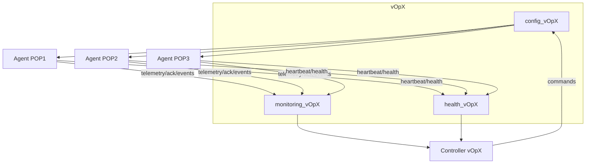
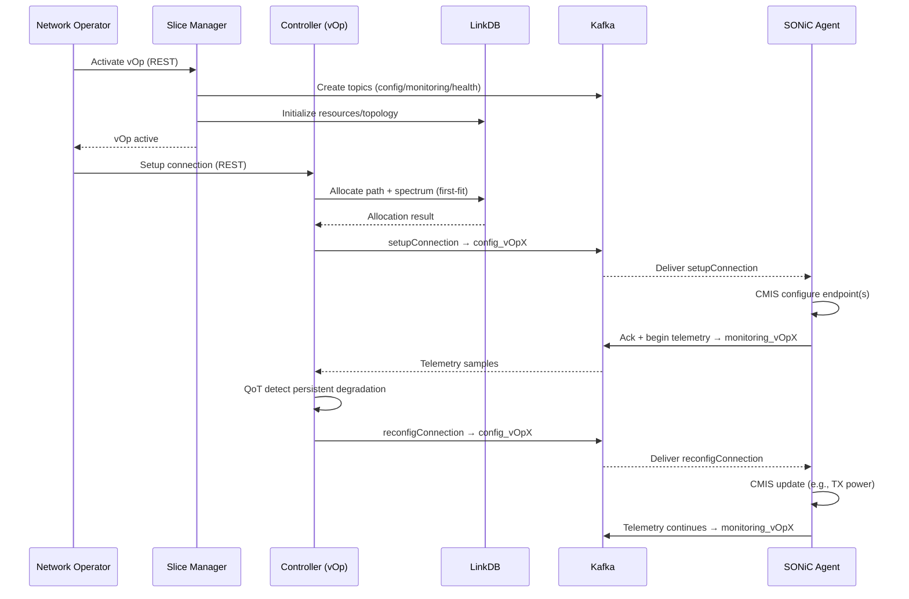
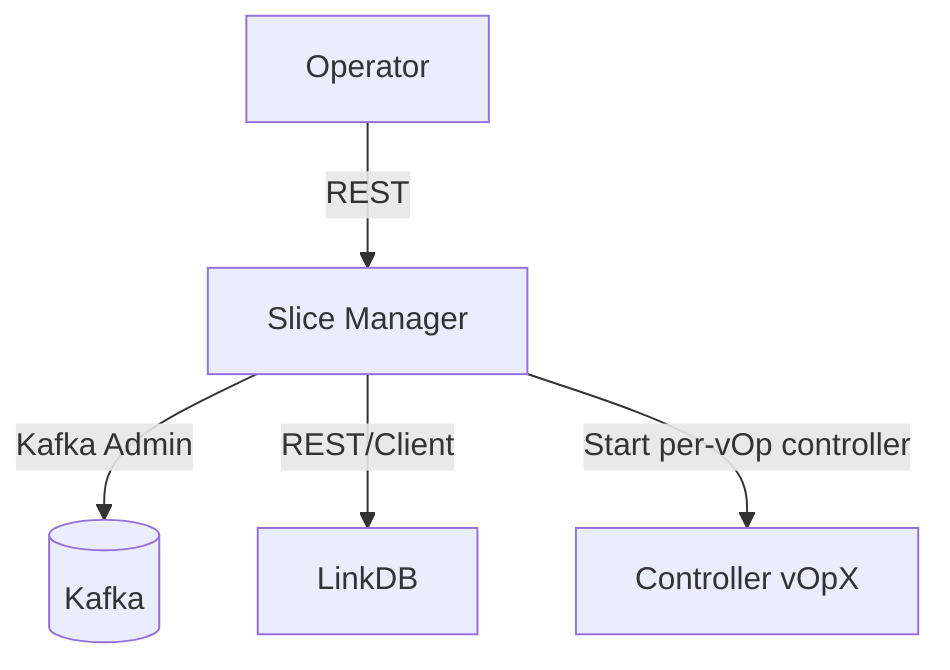
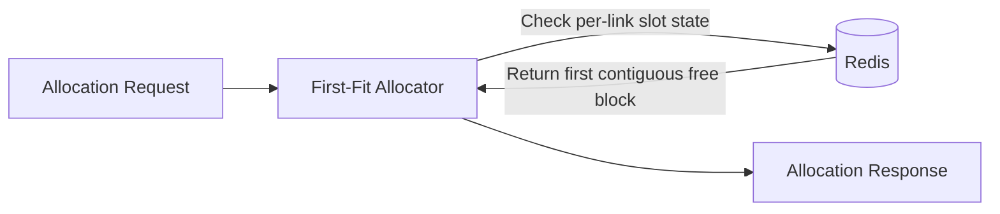

# IPoWDM Kafka-Based Control Plane (OFC) — Full Project Guide

This repository implements the Kafka-based control and monitoring plane described in the OFC paper (OFC26_kafka.pdf) for **multi-tenant IP-over-WDM** operation. The system provides:

- **Virtual Operator (vOp) activation** (per-tenant Kafka topic provisioning, per-vOp controller instances)
- **End-to-end optical connection setup** (path + spectrum allocation, endpoint configuration at SONiC edges)
- **Continuous CMIS telemetry** collection from SONiC-connected coherent optics
- **QoT-driven reconfiguration** (e.g., TX power adaptation) under persistent degradation

The system is realized as four cooperating services:
1) **Slice Manager** (central orchestration, multi-tenancy)
2) **Controller** (per vOp orchestration + control logic)
3) **Link Database (LinkDB)** (resource DB: topology + spectrum state, allocation)
4) **SONiC Agents** (distributed at POPs: CMIS read/write + telemetry)

---

## 1) Overall architecture

### 1.1 High-level view (operator → central → distributed)

```text
Network Operator
     │
     ▼ (HTTP/REST)
┌─────────────┐
│ Slice       │
│ Manager     │←─ Creates Kafka topics
│ (Central)   │←─ Updates Link DB
└──────┬──────┘
       │ (Kafka Messages)
       ▼
┌─────────────┐    ┌─────────────┐
│ IP-SDN      │    │ SONiC       │
│ Controller  │───▶│ Agent 1     │
│ (per vOp)   │    │ (POP1)      │
└─────────────┘    └─────────────┘
                         │
┌─────────────┐         │ (Kafka Messages)
│ SONiC       │◀────────┘
│ Agent 2     │
│ (POP2)      │
└─────────────┘
```

### 1.2 Control plane vs data plane separation

```text
┌─────────────────────────────────────────────────────────┐
│                 CONTROL PLANE (Central)                  │
├─────────────────────────────────────────────────────────┤
│  ┌──────────────────────────────────────────────────┐   │
│  │               Slice Manager                      │   │
│  │  • Multi-tenant orchestration                    │   │
│  │  • REST API (port 8082)                          │   │
│  │  • Kafka topic provisioning                      │   │
│  │  • Link DB initialization                        │   │
│  └──────────────────────────────────────────────────┘   │
│                              │                           │
│  ┌────────────┐  ┌──────────▼──────────┐  ┌──────────┐  │
│  │IP-SDN      │  │     Link Database   │  │ Kafka    │  │
│  │Controller  │  │     (Redis)         │  │ Cluster  │  │
│  │(per vOp)   │  │                     │  │          │  │
│  └────────────┘  └─────────────────────┘  └──────────┘  │
└──────────────────────────┬──────────────────────────────┘
                           │
┌──────────────────────────▼──────────────────────────────┐
│                 DATA PLANE (Distributed)                │
├─────────────────────────────────────────────────────────┤
│                                                         │
│  ┌────────────┐        ┌────────────┐        ┌────────┐ │
│  │ SONiC      │        │ SONiC      │        │ SONiC  │ │
│  │ Agent      │        │ Agent      │        │ Agent  │ │
│  │ (POP1)     │        │ (POP2)     │        │ (POP3) │ │
│  │            │        │            │        │        │ │
│  └────────────┘        └────────────┘        └────────┘ │
│       │                       │                       │  │
│  ┌────▼────┐            ┌────▼────┐            ┌────▼──┐│
│  │ CMIS    │            │ CMIS    │            │ CMIS  ││
│  │Transcv. │            │Transcv. │            │Transcv││
│  └─────────┘            └─────────┘            └───────┘│
└─────────────────────────────────────────────────────────┘
```

### 1.3 Interactive architecture (Mermaid)

```mermaid
flowchart LR
  NO[Network Operator] -->|HTTP/REST| SM[Slice Manager]
  SM -->|Update topology/resources| LDB[LinkDB]
  SM -->|Provision topics| K[(Kafka)]

  subgraph ControlPlane[CONTROL PLANE]
    SM
    CTRL[IP-SDN Controller (per vOp)]
    LDB
    K
  end

  subgraph DataPlane[DATA PLANE]
    A1[SONiC Agent (POP1)]
    A2[SONiC Agent (POP2)]
    A3[SONiC Agent (POP3)]
  end

  CTRL <--> K
  A1 <--> K
  A2 <--> K
  A3 <--> K
  CTRL -->|REST| LDB
  LDB <--> R[(Redis)]
```

---

## 2) Kafka topic model (vOp isolation)

Each vOp is isolated by topic namespace:
- `config_<vOp>`: controller → agents (commands)
- `monitoring_<vOp>`: agents → controller (telemetry, acknowledgements, QoT events)
- `health_<vOp>`: agent/service health (optional separate stream)



---

## 3) OFC paper alignment (Study Cases 1–3)

### Case 1 — Slice activation and capability advertisement
**Trigger:** Operator requests activation of a tenant/vOp via Slice Manager REST API.

**Expected system behavior:**
- Slice Manager provisions Kafka topics for the vOp (and optionally sets partitions/replicas).
- LinkDB is initialized/updated with topology resources for that vOp.
- Controller (per vOp) starts consuming monitoring streams and broadcasts discovery if enabled.
- Agents publish capabilities and health/heartbeat.

### Case 2 — SetupConnection orchestration
**Trigger:** Operator requests a new optical connection (REST call to controller or via orchestrated workflow).

**Expected system behavior:**
1. Controller requests path + spectrum from LinkDB (first-fit allocation).
2. Controller publishes `setupConnection` to `config_<vOp>` with endpoint parameters.
3. Each agent applies CMIS configurations for its endpoints and returns ack.
4. Agents start telemetry sessions and publish samples to `monitoring_<vOp>`.

### Case 3 — QoT monitoring & reconfiguration
**Trigger:** QoT degrades persistently (e.g., OSNR below threshold for N samples).

**Expected system behavior:**
- QoT monitor (controller-side and/or agent-side) detects persistence window and cooldown.
- Controller publishes `reconfigConnection` to adjust parameters (commonly TX power step).
- Agents apply CMIS writes and continue telemetry until stabilization.

Interactive sequence diagram:



---

## 4) Repository structure (canonical)

Recommended structure for a clean, reproducible repository (apply per-repo if split):

```
./
  controller/
    app.py
    api/
      routers.py
      dependencies.py
    core/
      kafka_manager.py
      agent_dispatcher.py
      qot_monitor.py
      connection_manager.py
      path_computer.py
      linkdb_client.py
    config/
      settings.py
    requirements.txt
    Dockerfile.controller
    docker-compose-controller.yml
    deploy-controller.sh

  linkdb/
    main.py
    first_fit.py
    config.py
    schemas.py
    requirements.txt
    Dockerfile
    docker-compose.yml
    deploy.sh

  slice_manager/
    main.py
    slice_orchestrator.py
    kafka_admin.py
    linkdb_client.py
    schema.py
    dependencies.py
    settings.py
    requirements.txt
    Dockerfile
    docker-compose.yml
    deploy.sh

  agent/
    run_agent.py
    sonic_agent.py
    core/
      agent_orchestrator.py
      kafka_manager.py
      telemetry_manager.py
      cmis_driver.py
    models/
      schemas.py
    config/
      settings.py
    scripts/
      configure_agent.sh
      deploy_agent.sh
      discover_hardware.py
      health_check.py
      test_cmis.py
    Dockerfile
    docker-compose.yml
```

---

## 5) Component deep-dive (what each module does)

### 5.1 Slice Manager (Central)
Responsibilities:
- Multi-tenant orchestration
- REST API for vOp lifecycle (commonly port 8082)
- Kafka topic provisioning per vOp
- Optional LinkDB initialization/update

Interactive diagram:



### 5.2 LinkDB (Redis-backed resource DB)
Responsibilities:
- Store topology (POPs, routers, optical links)
- Track spectrum occupancy
- Allocate frequency slots using **first-fit** (paper-aligned spectrum assignment behavior)

First-fit allocation conceptual view:



### 5.3 Controller (per vOp)
Responsibilities:
- Expose REST APIs to create/setup/teardown/reconfigure connections
- Interact with LinkDB for resource allocation
- Publish commands to agents via `config_<vOp>`
- Consume telemetry/health/ack streams from agents via `monitoring_<vOp>` / `health_<vOp>`
- Run QoT logic (persistency + cooldown) and trigger reconfiguration

Interactive component diagram:

```mermaid
flowchart LR
  subgraph Controller[Controller (vOp)]
    API[FastAPI Routes]
    DI[Dependencies / DI]
    KM[KafkaManager]
    AD[AgentDispatcher]
    QM[QoTMonitor]
    CM[ConnectionManager]
    PC[PathComputer]
    LDBC[LinkDBClient]
  end

  API --> DI
  DI --> KM
  DI --> AD
  DI --> QM
  DI --> CM
  DI --> PC
  DI --> LDBC

  KM <--> K[(Kafka)]
  LDBC --> LDB[LinkDB]
```

### 5.4 SONiC Agent (Distributed at POPs)
Responsibilities:
- Listen to `config_<vOp>` commands
- Apply CMIS configuration on coherent optics
- Stream telemetry samples periodically (default: ~3s)
- Optionally detect QoT degradation locally and emit events

#### 5.4.1 Agent architecture diagram (as requested)

```text
2.1 Agent Architecture
    ┌─────────────────────────────────────────┐
    │           SonicAgent                    │
    │  - Agent state management               │
    │  - Main orchestration loop              │
    └─────────────┬───────────────────────────┘
                  │
    ┌─────────────▼───────────────────────────┐
    │       AgentOrchestrator                 │
    │  - Command processing                   │
    │  - Implements 3 paper cases             │
    └─┬──────────┬──────────────┬─────────────┘
      │          │              │
    ┌─▼─┐      ┌─▼─┐          ┌─▼─┐
    │Kafka│     │CMIS│         │Tele-│
    │Manager   │Driver│        │metry│
    └────┘     └────┘         │Manager
                               └─────┘
```

#### 5.4.2 CMIS Driver module (cmis_driver.py)
- Hardware abstraction for coherent pluggables (e.g., 400G ZR class)
- SONiC platform library integration
- Mock mode for development/testing
- Key operations: configure endpoint parameters and read telemetry

#### 5.4.3 Telemetry Manager (telemetry_manager.py)
- Default periodic collection (paper-aligned ~3 seconds)
- Session management per connection_id
- QoT monitoring heuristics: persistency windows and cooldowns
- Emits `telemetrySample` messages and optionally `qotEvent` messages

#### 5.4.4 Deployment & discovery
- `deploy_agent.sh`: deployment pipeline (build/run)
- `discover_hardware.py`: interface discovery
- `configure_agent.sh`: environment configuration + vOp topic naming

---

## 6) Deployment and operations

### 6.1 Containerized deployment (recommended)
```text
6.1 Containerized Deployment
    ├── Docker Compose setup
    ├── Host network mode for hardware access
    ├── SONiC platform library mounting
    └── Log rotation and health checks
```

### 6.2 Hardware integration
```text
6.2 Hardware Integration
    ├── SONiC switch requirements
    ├── CMIS transceiver compatibility
    ├── Interface discovery process
    └── Mock mode for development
```

### 6.3 Monitoring & troubleshooting
```text
6.3 Monitoring & Troubleshooting
    ├── Health check scripts
    ├── Log analysis
    ├── Kafka topic inspection
    └── Hardware diagnostic commands
```

---

## 7) Operator guide: commands and workflows

### 7.1 Start LinkDB
From `linkdb/`:
```bash
docker compose up -d --build
# or
./deploy.sh
```

Health:
```bash
curl -s http://<LINKDB_HOST>:8000/health | jq .
```

### 7.2 Start Slice Manager
From `slice_manager/`:
```bash
docker compose up -d --build
# or
./deploy.sh
```

Health:
```bash
curl -s http://localhost:8082/health | jq .
```

### 7.3 Start Controller (per vOp)
From `controller/`:
```bash
docker compose -f docker-compose-controller.yml up -d --build
# or
./deploy-controller.sh
```

Logs:
```bash
docker logs -f ipowdm-controller
```

### 7.4 Start Agents (on each SONiC switch)
From `agent/` on the SONiC host:
```bash
./scripts/configure_agent.sh
docker compose up -d --build
```

Logs:
```bash
docker compose logs -f
```

Stop:
```bash
docker compose down
```

Quick CMIS test (inside container):
```bash
python3 scripts/test_cmis.py
```

---

## 8) Controller REST API (main operator surface)

Below are the main operator-facing calls (adjust host/port as deployed).

### Health and status
```bash
curl -s http://<CTRL_HOST>:8083/api/v1/health | jq .
curl -s http://<CTRL_HOST>:8083/api/v1/status | jq .
```

### Topology views (via LinkDB)
```bash
curl -s http://<CTRL_HOST>:8083/api/v1/topology | jq .
curl -s http://<CTRL_HOST>:8083/api/v1/topology/pops | jq .
curl -s http://<CTRL_HOST>:8083/api/v1/topology/links | jq .
```

Compute a path:
```bash
curl -s http://<CTRL_HOST>:8083/api/v1/topology/path/pop1/pop2 | jq .
```

### Connection lifecycle
Create a connection record:
```bash
curl -s -X POST http://<CTRL_HOST>:8083/api/v1/connections \
  -H 'Content-Type: application/json' \
  -d '{"connection_id":"POP1-POP2-1","source_pop":"pop1","destination_pop":"pop2","virtual_operator":"vOp2"}' | jq .
```

List/get connections:
```bash
curl -s http://<CTRL_HOST>:8083/api/v1/connections | jq .
curl -s http://<CTRL_HOST>:8083/api/v1/connections/POP1-POP2-1 | jq .
```

Setup a connection (Case 2):
```bash
curl -s -X POST http://<CTRL_HOST>:8083/api/v1/connections/POP1-POP2-1/setup \
  -H 'Content-Type: application/json' \
  -d '{}' | jq .
```

Reconfigure a connection (Case 3):
```bash
curl -s -X POST http://<CTRL_HOST>:8083/api/v1/connections/POP1-POP2-1/reconfigure \
  -H 'Content-Type: application/json' \
  -d '{"reason":"manual","tx_power_step_db":0.5}' | jq .
```

Delete/teardown:
```bash
curl -s -X DELETE http://<CTRL_HOST>:8083/api/v1/connections/POP1-POP2-1 | jq .
```

### Agents and interfaces
List discovered agents:
```bash
curl -s http://<CTRL_HOST>:8083/api/v1/agents | jq .
```

Trigger agent discovery:
```bash
curl -s -X POST http://<CTRL_HOST>:8083/api/v1/agents/discover | jq .
```

Inspect agent and its interfaces:
```bash
curl -s http://<CTRL_HOST>:8083/api/v1/agents/pop1/router1 | jq .
curl -s http://<CTRL_HOST>:8083/api/v1/interfaces/pop1/router1 | jq .
```

Interface control (example):
```bash
curl -s -X POST http://<CTRL_HOST>:8083/api/v1/interfaces/pop1/router1/Ethernet48/control \
  -H 'Content-Type: application/json' \
  -d '{"admin_state":"up"}' | jq .
```

---

## 9) Kafka verification and manual testing

Consume telemetry/events:
```bash
kafka-console-consumer --bootstrap-server <BROKER> --topic monitoring_<vOp> --from-beginning
```

Consume commands (debug):
```bash
kafka-console-consumer --bootstrap-server <BROKER> --topic config_<vOp> --from-beginning
```

Publish a manual setupConnection command (debug):
```bash
kafka-console-producer --bootstrap-server <BROKER> --topic config_<vOp>
{"action":"setupConnection","command_id":"setup-POP1-POP2-1","parameters":{"connection_id":"POP1-POP2-1","endpoint_config":[{"pop_id":"pop1","node_id":"router1","port_id":"Ethernet48","frequency":193.1,"tx_power_level":-2.0}]}} 
```

---

## 10) Message formats (reference)

### setupConnection (controller → agent)
```json
{
  "action": "setupConnection",
  "command_id": "setup-POP1-POP2-1",
  "parameters": {
    "connection_id": "POP1-POP2-1",
    "endpoint_config": [
      { "pop_id": "pop1", "node_id": "router1", "port_id": "Ethernet48", "frequency": 193.1, "tx_power_level": -2.0 }
    ]
  }
}
```

### telemetrySample (agent → controller)
```json
{
  "type": "telemetrySample",
  "connection_id": "POP1-POP2-1",
  "agent_id": "pop1-router1",
  "interface": "Ethernet48",
  "timestamp": 1730000000.123,
  "fields": {
    "rx_power": -12.3,
    "osnr": 21.4,
    "ber": 0.0002,
    "tx_power": -2.0
  }
}
```

### reconfigConnection (controller → agent)
```json
{
  "action": "reconfigConnection",
  "command_id": "reconfig-POP1-POP2-1-1730",
  "parameters": {
    "connection_id": "POP1-POP2-1",
    "reason": "OSNR degraded",
    "endpoint_config": [
      { "pop_id": "pop1", "node_id": "router1", "port_id": "Ethernet48", "tx_power_level": -1.5 }
    ]
  }
}
```

---

## 11) End-to-end test plan (paper-style validation)

### Test A — Case 1: tenant activation and agent discovery
1. Start Kafka, LinkDB, Slice Manager, Controller.
2. Start agents with `VIRTUAL_OPERATOR=vOp2`.
3. Verify:
   - topics exist: `config_vOp2`, `monitoring_vOp2`, `health_vOp2`
   - controller shows agents in `/api/v1/agents`
   - health/heartbeat messages are present

### Test B — Case 2: setupConnection
1. Create/populate topology in LinkDB.
2. Create a connection record in controller.
3. Call `/connections/{id}/setup`.
4. Verify:
   - LinkDB allocates slots (first-fit)
   - `setupConnection` appears on `config_vOp2`
   - telemetry samples appear on `monitoring_vOp2`

### Test C — Case 3: QoT degradation & reconfiguration
1. Force degraded QoT (lab impairment) or inject low OSNR/high BER samples.
2. Verify:
   - QoT monitor triggers after persistent degradation
   - controller publishes `reconfigConnection`
   - agent applies CMIS update (e.g., TX power)
   - telemetry continues and stabilizes

---

## 12) Troubleshooting checklist

1. Kafka reachability (routing/NAT/port exposure)
2. Topic naming mismatch (controller vs agent)
3. Health stream mismatch (`health_<vOp>` vs `monitoring_<vOp>` for heartbeats)
4. SONiC CMIS permissions (privileged container + mounts)
5. Interface mapping mismatch (`IFNAME_TO_PORTNUM_JSON` vs actual port numbering)
6. Telemetry interval too aggressive (CPU load)
7. Time skew across hosts (impacts persistency windows/cooldowns)
8. Confirm agent is not running legacy topic names (`config-topic`, `monitoring-topic`) when using per-vOp deployment

---

## 13) Quick reference

### Agent (on SONiC)
```bash
./scripts/configure_agent.sh
docker compose up -d --build
docker compose logs -f
docker compose down
```

### Controller
```bash
docker compose -f docker-compose-controller.yml up -d --build
docker logs -f ipowdm-controller
```

### Kafka validation
```bash
kafka-console-consumer --bootstrap-server <BROKER> --topic monitoring_<vOp> --from-beginning
```

---

## 14) Optional: additional interactive diagrams you can add later

If you want even more interactive diagrams, these Mermaid types also work well in GitHub:
- `stateDiagram-v2` for connection state machine (IDLE → SETUP → ACTIVE → DEGRADED → RECONFIG → ACTIVE → TEARDOWN)
- `erDiagram` for LinkDB Redis schema abstraction (POPs, Routers, Links, Slots, Connections)
- `gantt` for deployment/activation sequences in lab experiments

You can extend this guide with those diagrams once you finalize the exact LinkDB key schema you want to standardize.
